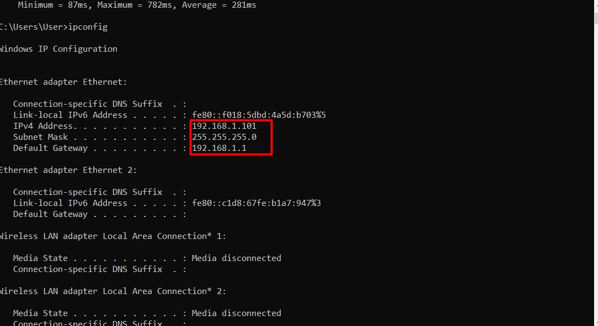
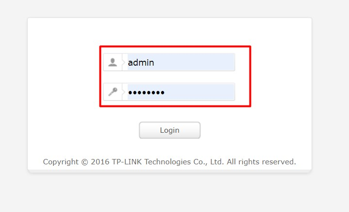
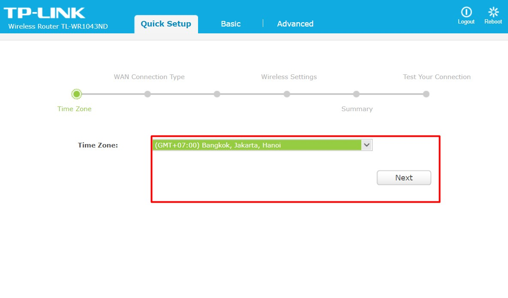
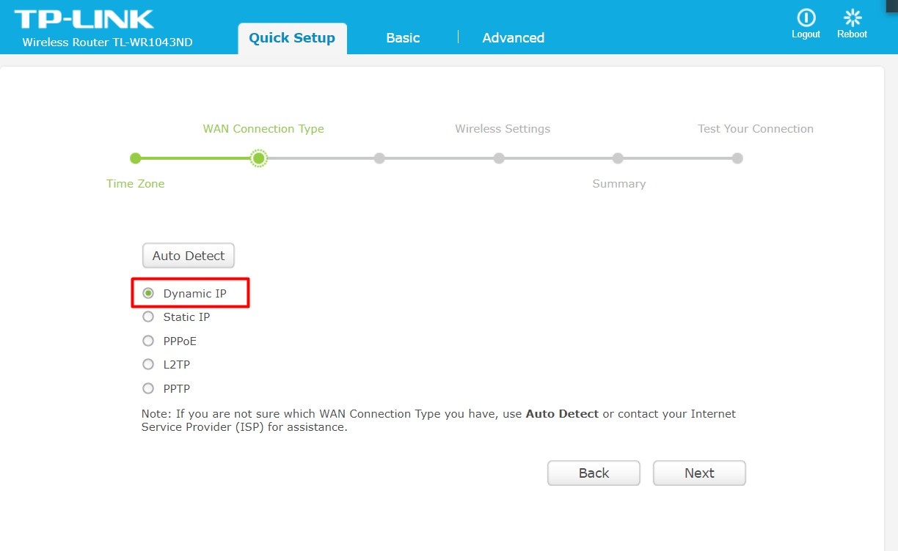
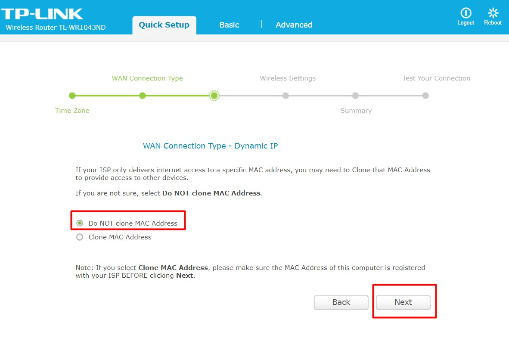
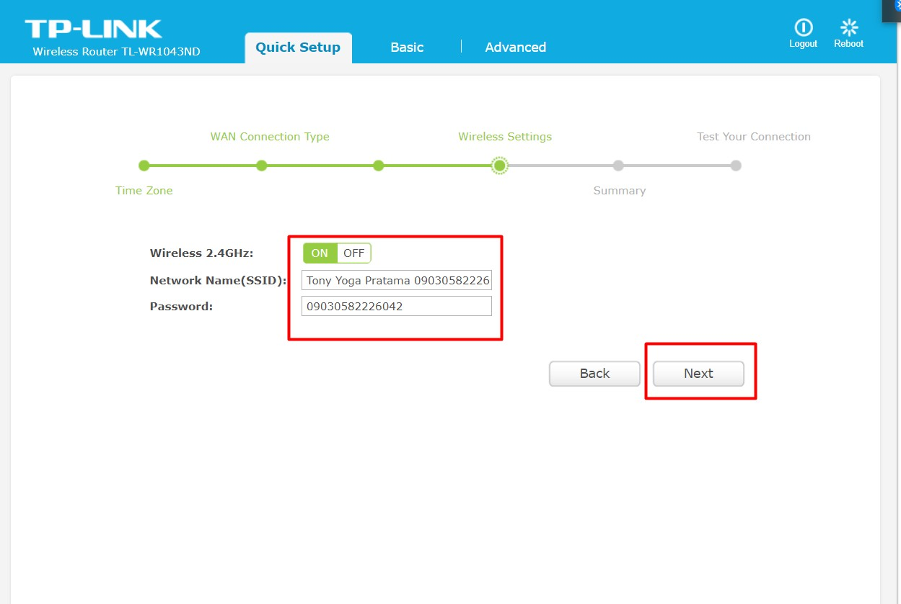
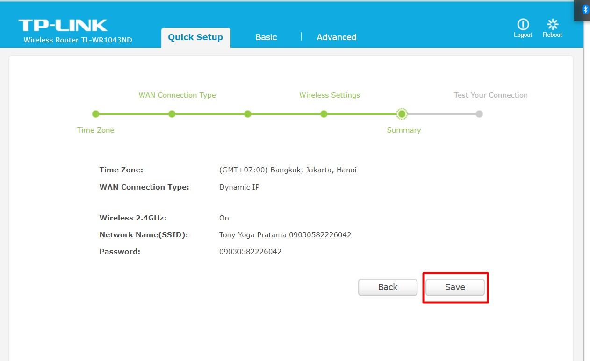
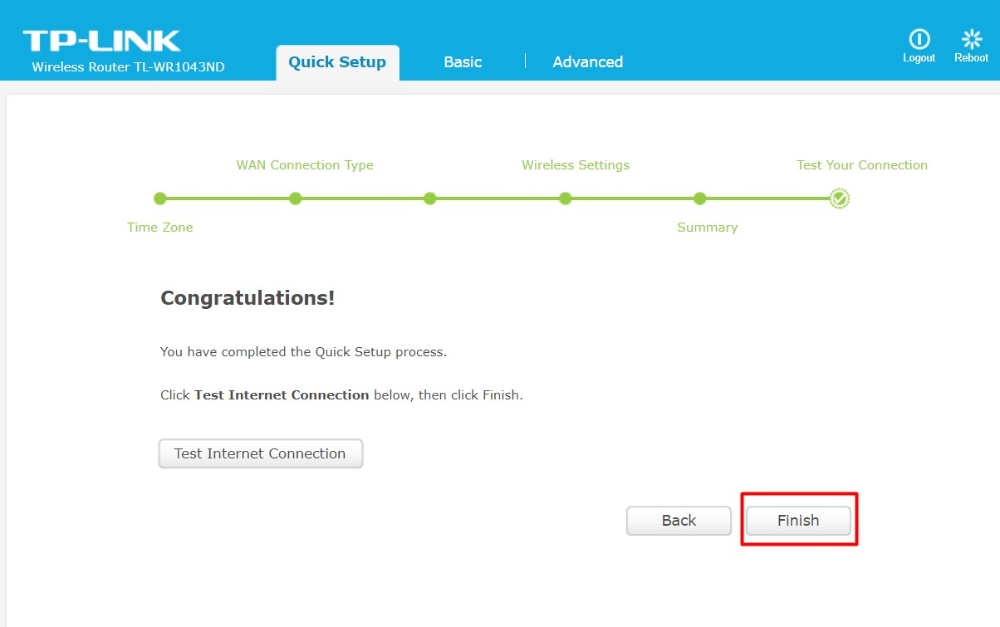
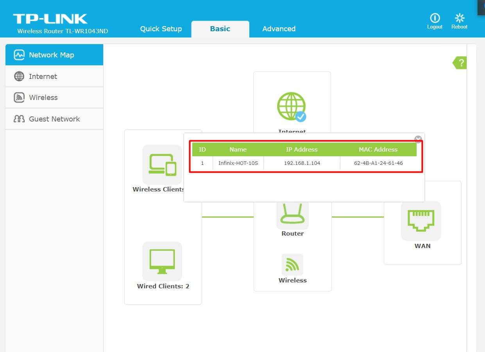

# Access Point

#### 1. Untuk mengatur access point kita harus menemukan IP dari switch/router tersebut

#### 2. Masukkan username dan password dari switch tersebut

#### 3. Atur Time Zone 

#### 4. Atur WAN Connection Type menjadi Dynamic IP selanjutnya Do NOT clone MAC Address

#### 5. Pada Wireless setinggs atur network dan password selanjutnya klik save saja

#### 6. Selanjutnya klik finish

#### 7. Dan sambungkan ke HP atau perangkat kalian

